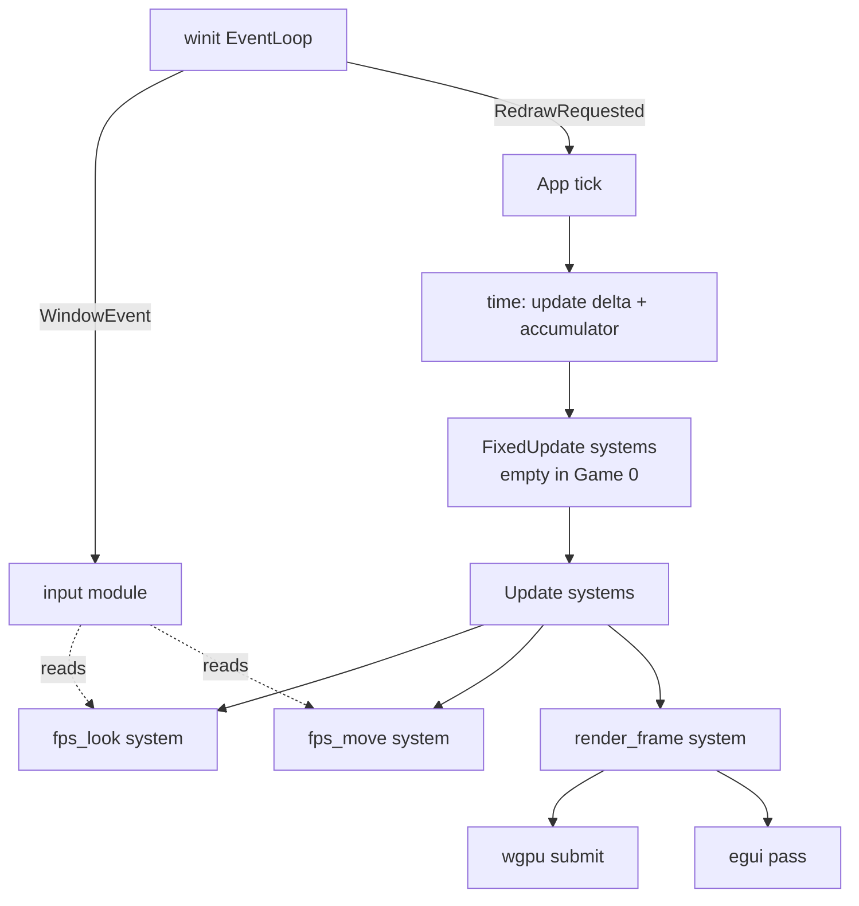
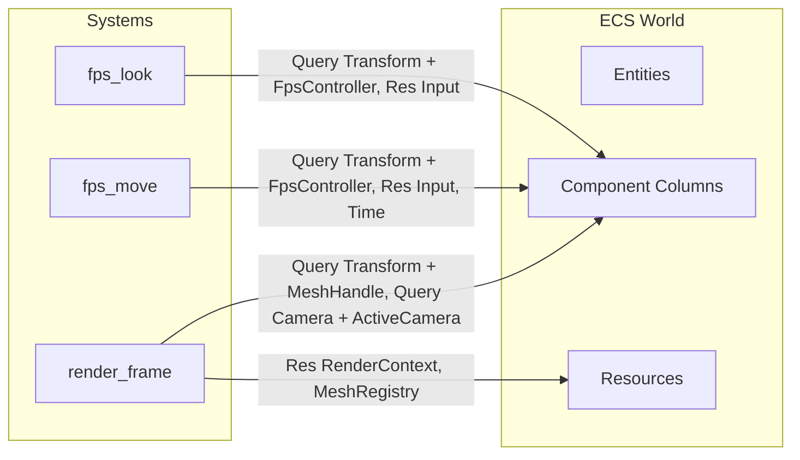

# Game 0 — The Void: Engine Bootstrap Plan

> The goal of Game 0 is not a game. It is to stand up the **minimum coherent engine skeleton** — ECS, window, renderer, input, camera, debug overlay — in a way whose shape will not have to be thrown away when Games 1–4 layer on physics, scripting, AI, and open-world systems.

---

## 1. Resolved Architectural Decisions

### 1.1 ECS Storage Model — **Sparse-set primary**, with change-detection substrate built in from day one

**Choice:** One sparse-set per component type. Single-threaded scheduler for Game 0. Per-component mutation-tick tracking wired into the storage from the start, even though no consumer uses it yet.

**Reasoning:**
- The scripting language (shik) is the engine's long-term primary consumer of the ECS, not Rust systems. Shik's "organism not castle" philosophy wants entities to be composable property sets where components attach and detach freely at runtime. Sparse-set storage matches that shape natively; archetype storage fights it.
- **LOD hydration/dehydration in Game 4 is structural, not marginal.** Zone streaming will add and remove on the order of 10–15 components on a large fraction of NPCs every time the player crosses a chunk boundary (Velocity, Mesh, Animator, Collider, FullAIBrain, Buffs, SoundEmitter, …). Archetype storage pays a full-entity memcpy migration cost per transition, at scale, every boundary crossing. Sparse-set: O(1) per add/remove, no migration.
- **Reactive subscriptions are the substrate of shik's behavior model**, not an afterthought. `when (hp < 30) ...`, `on :pack-member-died ...` are first-class idioms in the target gameplay code. Per-component dirty-flag hooks in the storage are cheap to add now and awkward to retrofit later; building them alongside the storage makes the reactive-cascade layer's Game 2 integration a wiring exercise, not an engine rewrite.
- **Iteration cost is acceptable for Games 0–3.** Sparse-set joins are slower than archetype column iteration (pointer-chasing to check presence across multiple sparse-sets), but at Game 0 entity scale it is not the bottleneck. When Game 3's outdoor scenes or Game 4's NPC counts make it one, **dense-packed "view" caches** — mirrors of specific component packs, kept in sync via the dirty flags we already have — close the gap without changing the storage contract that shik sees.

**Tradeoffs accepted:**
- Bulk iteration over entities with 2+ components requires sparse-set joins (walk the smallest set, probe the others). Measurably slower than archetype iteration. Mitigation deferred to Game 3 via dense views when profiling justifies it.
- Cache locality is worse for join iteration. Same mitigation.
- No free parallelism across disjoint component sets the way archetype storage gives you. Not needed in Game 0; revisit when threading matters (likely Game 4).

**What is NOT in Game 0 (named so we resist scope creep):**
- Reactive cascade engine (subscription → handler → mutation → cascade). Game 2.
- Dense-view hot-path caches. Game 3+ if needed.
- Relationship graph as first-class storage. Parked known-unknown, revisit Game 4.
- Dynamic query API (`world.query_dyn(&[component_ids])`). Game 2 alongside shik integration. Internal representation leaves room for it; public API stays static-typed for Game 0.

### 1.2 Entity ID — **Generational index, 64-bit packed**

**Choice:** `EntityId { index: u32, generation: u32 }`, 8 bytes, `Copy`.

**Reasoning:**
- Generational indices are the battle-tested solution to the "stale reference" problem: when an entity is despawned and its slot reused, the generation bumps, and any old `EntityId` referring to that slot is detectable as stale.
- `u32` index caps at ~4B entities — fine for single-world simulation even at Game 4 scale.
- `u32` generation gives 4B reuses of a slot before wraparound. For a long-running simulation this is enough; if it ever matters, the top bit of index can be repurposed.
- 8 bytes fits comfortably in a register; passing `EntityId` by value is free.
- Named/stable string IDs for authored content (e.g. quest targets, prefabs) are a **separate concern** — handled later via a `HashMap<NameHash, EntityId>` registry living as a Resource, not baked into `EntityId`.

### 1.3 Coordinate System & Depth

- **Y-up, right-handed.** Matches glTF, Unity, Unreal (logical), and most tooling the user will import from.
- **NDC depth: 0..1** (wgpu/Vulkan/D3D convention, not OpenGL's -1..1). This is wgpu's default.
- **Reverse-Z deferred.** Standard 0..1 forward-Z for Game 0. Reverse-Z is a worthwhile precision win for large outdoor terrain in Game 3 but adds pipeline complexity we do not need now.
- **Units: 1.0 = 1 meter.** Rapier assumes this; setting the convention early avoids later scale wars.

### 1.4 Shader & Asset Strategy for Game 0

- **Shaders:** WGSL only. Shaders live in `engine/shaders/*.wgsl`, loaded at runtime (not embedded) so we can iterate without recompiling Rust. Hot-reload is a stretch goal.
- **Meshes:** Hard-coded cube + plane generated in Rust. No file loader.
- **Textures:** One hard-coded checker texture generated in Rust for the floor. Optional.

### 1.5 Platforms

- Windows + Linux + macOS from day one. wgpu and winit abstract the differences. We will CI on all three as soon as the repo has something to build (can start with just `cargo check`).

### 1.6 Done Bar for Game 0

Game 0 is complete when **all** of these are true:
1. A window opens on Win/Linux/Mac.
2. A 3D scene with a floor + several cubes + one directional light renders with Blinn–Phong shading.
3. First-person WASD + mouse-look camera works, mouse is captured and hideable with Esc.
4. A debug overlay (egui) shows FPS, frame time, entity count, camera position.
5. A CPU profiler (puffin or tracing) has been wired up and at least one scope is visible.
6. The game loop uses a correct fixed-timestep accumulator for "simulation" steps even though nothing yet needs it — Game 1's physics will plug straight in.
7. The ECS records per-component mutation ticks on any `&mut` access, and `World::changed_since::<T>(tick)` returns entities whose `T` mutated since a given tick. No consumer wired yet — the substrate exists and is unit-tested.
8. `cargo run -p game-void` works from a clean clone on all three platforms.

### 1.7 Dynamic Philosophy — Named Open Questions

The engine is being built for shik, a language whose philosophy is "programs as organisms, not castles" — rapid prototyping, REPL-driven iteration, hot-reload, composable modules. Static typing is compatible with this: **rules are strict, shape is fluid**. Component type definitions are the rules (compile-time, typed); which components attach to which entity is the shape (runtime, fluid); behavior implementations are hot-swappable with typed signatures as the stable contract.

Game 0 does not resolve any of the following, but **names** them so later work is not blindsided:

- **Reactive cascade semantics** — how synchronous subscription cascades behave. Current leaning: synchronous with bounded recursion depth. Decide before Game 2.
- **Component schema ownership (Rust vs shik)** — who defines component types at the boundary. Current leaning: Rust owns engine-intrinsic components; shik owns game-defined; shared schema description keeps both honest. Decide during Game 2 design.
- **LOD continuity fidelity** — how dehydrated NPCs are reconciled on rehydration. Current leaning: narrative-important hybrid. Decide during Game 4 planning.
- **Engine-wide hot-reload obligations** — the organism philosophy extends to shaders and assets, eventually Rust-side live-edit. Shader hot-reload is a Game 0 stretch goal; asset hot-reload lands with Game 2's asset pipeline.

These live in `plans/plan.md` under "Critical Design Decisions" as well.

---

## 2. Workspace Layout

Starting as **2 crates**, with clear internal module boundaries inside `schooner-engine` so extraction later is mechanical.

```
schooner/
├── Cargo.toml                  # workspace
├── crates/
│   ├── schooner-engine/        # all engine code (library crate)
│   │   ├── Cargo.toml
│   │   ├── shaders/
│   │   │   └── forward.wgsl
│   │   └── src/
│   │       ├── lib.rs
│   │       ├── app.rs          # App runner, main loop
│   │       ├── time.rs         # Delta / fixed timestep
│   │       ├── ecs/            # archetype ECS
│   │       ├── window/         # winit wrapper
│   │       ├── input/          # keyboard + mouse state
│   │       ├── render/         # wgpu renderer
│   │       ├── camera/         # camera component + controller
│   │       ├── debug/          # egui overlay + profiling
│   │       └── math.rs         # re-exports glam + helpers
│   └── game-void/              # Game 0 binary
│       ├── Cargo.toml
│       └── src/
│           └── main.rs
├── plans/
└── README.md
```

External crates we will use (no need to reinvent yet):
- `wgpu`, `winit`, `glam`, `bytemuck`, `pollster` (or `futures-lite`) for async init, `egui` + `egui-wgpu` + `egui-winit`, `puffin` + `puffin_egui`, `log` + `env_logger`, `thiserror`, `anyhow` (app-level only).

Explicitly **not yet** pulled in: `rapier`, `gltf`, any scripting VM, any audio lib. They arrive with the game that needs them.

---

## 3. Engine Module Architecture

### 3.1 `app` — Application Lifecycle

A thin `App` struct that:
- Owns the `Window`, `Renderer`, `World` (ECS), and `Scheduler`.
- Runs the main loop via `winit`'s `EventLoop::run`.
- Dispatches events: `WindowEvent` → `input` module updates input state; `RedrawRequested` → tick + render.

Public surface the game crate uses:
```rust
App::new()
    .add_startup_system(spawn_scene)
    .add_system(player_controller)
    .add_system(camera_update)
    .run();
```

### 3.2 `time` — Fixed + Variable Timestep

- `Time` resource: `delta_secs: f32`, `elapsed_secs: f64`, `fixed_delta: f32` (e.g. `1.0 / 60.0`).
- Main-loop structure: accumulator pattern.
  - Each frame: accumulate real elapsed, run 0..N fixed-update steps, then one render pass with an interpolation alpha.
- Two system stages wired in from day one: **`Update`** (variable, runs once per frame — input, camera, debug) and **`FixedUpdate`** (runs 0..N times per frame — reserved for physics in Game 1).

### 3.3 `ecs` — Sparse-Set ECS with Change-Detection Substrate

Minimum viable surface for Game 0, designed so Game 2's scripting layer binds onto it without reshaping the core.

**Core types**
- `EntityId` (8 bytes, generational).
- `Component` trait: marker, `: 'static + Send + Sync`. No derive yet; blanket impl.
- `ComponentId` — interned `TypeId` → `u32`.
- `SparseSet<T>` per component type:
  - `sparse: Vec<Option<DenseIndex>>` — entity index → dense slot.
  - `dense: Vec<(EntityId, T)>` — packed instances.
  - `ticks: Vec<ChangeTicks>` — parallel to `dense`, per-instance `last_mutation_tick: u64`.
- `ComponentStorage` trait — type-erased wrapper so `World` holds heterogeneous sparse-sets in a `HashMap<ComponentId, Box<dyn ComponentStorage>>`.
- `World` — owns: entity allocator, component storages, resource map, monotonic `current_tick: u64`.
- `Resource` — singleton data in `HashMap<TypeId, Box<dyn Any>>`. Used for `Time`, `Input`, `RenderContext`, etc.

**Change-detection substrate (built in from day one, consumed by no one yet)**
- Every mutable access via `World::get_mut::<T>(entity)` returns a `Mut<T>` smart pointer that bumps `last_mutation_tick = current_tick` on `DerefMut`. Read-only `World::get::<T>` does not bump the tick.
- `World::current_tick` increments once per `Schedule::run`, before any system runs. This is what observers compare against.
- `World::changed_since::<T>(tick: u64) -> impl Iterator<Item = EntityId>` returns entities whose `T` mutated after `tick`. Substrate only — no subscribers, no cascade, no `Changed<T>` query filter yet. All Game 2.

**Query API (Game 0 — static-typed for Rust, internal shape leaves room for dynamic for shik)**
- Static-typed queries for Rust systems: `Query<(&Transform, &mut MeshHandle)>`, up to 3-tuples for Game 0.
- `Query<(..., Without<C>)>` exclusion filter.
- `Res<T>` / `ResMut<T>` for resource access inside systems.
- Implementation: resolve each component in the tuple to a `ComponentId`, pick the sparse-set with the smallest `dense.len()` as the driver, iterate its dense array, probe each other sparse-set's `sparse` for presence. Classic sparse-set join.
- The internal representation uses `ComponentId` values, not compile-time types, under the static API. This leaves room for a Game 2 dynamic surface (`world.query_dyn(&[component_ids])`) that reuses the same join logic — only the public surface changes. **Do not hard-bake static-tuple-only assumptions into the join code.**

**Scheduling (Game 0)**
- `Schedule` = ordered `Vec<BoxedSystem>`. Systems are plain functions; a small `IntoSystem` trait + `SystemParam` reflection turns `fn(Query<…>, Res<…>)` into a boxed system (same trick Bevy uses, minimal version).
- Two stages: `Update` (variable) and `FixedUpdate` (physics-ready, empty in Game 0).
- Single-threaded. Parallel scheduler deferred (likely Game 4).
- `Schedule::run` bumps `World::current_tick` once, then runs all systems.

**Spawning pattern**
- `world.spawn().insert(Transform::default()).insert(MeshHandle(0)).id()`. With sparse-set storage each insert is O(1); no archetype migration, no deferred-commit builder needed.

**Explicit non-goals for Game 0**
- No reactive cascade engine (subscribers firing on change) — Game 2.
- No dynamic `query_dyn` public surface — Game 2 alongside shik integration.
- No `Changed<T>` query filter — Game 2.
- No dense-packed hot-path caches — Game 3+ if profiling demands.
- No relationship graph as first-class — parked.
- No serialization, no reflection, no hierarchies/parenting, no events.
- No parallel scheduling.

**Why this is enough for Game 0 and right for later:** the renderer, camera, and input systems only need Rust-owned components and static-typed queries — both exist on day one. The change-detection ticks do nothing observable in Game 0, but their presence means Game 2's reactive-cascade engine is wired on top of a working substrate instead of requiring storage changes. LOD hydration in Game 4 is O(1) per component instead of a per-entity archetype migration. The `ComponentId`-based join internals mean shik's dynamic query API in Game 2 is a new surface, not a storage reshape.

### 3.4 `window` — winit Integration

- Thin wrapper: `Window::new(title, size) -> (Window, EventLoop)`.
- Ownership: `App` holds the `Window`; the event loop drives everything and is consumed by `run`.
- Window events are translated into typed internal events or fed directly into `input` and `render` modules.
- Handles resize (forwards new size to `Renderer::resize`), focus gain/loss (for mouse grab), close request.

### 3.5 `input` — Keyboard + Mouse Abstraction

- `Input` resource updated once per frame from accumulated `WindowEvent`s.
- Surface:
  - `is_down(KeyCode)` / `just_pressed(KeyCode)` / `just_released(KeyCode)`.
  - `mouse_delta() -> Vec2` (raw-ish motion, reset each frame).
  - `mouse_position() -> Vec2`.
  - `mouse_button_down(MouseButton)` / `just_pressed`.
  - `cursor_grabbed: bool`, `cursor_visible: bool`.
- Mouse grab is owned here: `Input::set_cursor_grabbed(bool)` calls through to `Window`.
- No gamepad support in Game 0.

### 3.6 `render` — wgpu Forward Renderer

This is the biggest subsystem. Designed in three layers so each can be understood and extended independently.

**Layer A — Device/Context (`render/context.rs`)**
- `RenderContext` resource: owns `wgpu::Instance`, `Adapter`, `Device`, `Queue`, `Surface`, `SurfaceConfiguration`, depth texture.
- `resize(width, height)` recreates swap chain + depth.

**Layer B — GPU Resource Management (`render/resources.rs`)**
- `MeshGpu` — vertex buffer, index buffer, index count.
- `MeshRegistry` resource: handle → `MeshGpu`. The engine eagerly registers two **built-in** meshes during render init — `MeshHandle::CUBE` (= 0) and `MeshHandle::PLANE` (= 1) — as public constants. User-defined meshes start at higher indices via `MeshRegistry::insert`. Built-ins are not Game 0 content — they're test rigs every later game (physics demos, scripting REPL, debug spawns) will want, so they live in the engine, not in `game-void`.
- `CameraUniform` — view matrix, proj matrix, view-proj, camera position; one `wgpu::Buffer` + `BindGroup`.
- `GlobalLightUniform` — one directional light (direction, color, ambient).
- `ModelUniform` — per-draw model matrix, written into a single uniform buffer sized for N draws and indexed via **dynamic offset** at bind time. Push constants are rejected: they require the non-default `Features::PUSH_CONSTANTS`, and at Game 0 entity counts the perf delta is invisible. Dropping the feature gate keeps "works on a clean wgpu install" portable.
- No material system yet — shader is hard-coded to Blinn–Phong with uniforms.

**Layer C — Frame Execution (`render/forward.rs`)**
- One system `render_frame` runs last every `Update`. Ordering is achieved by having the engine append `render_frame` to the schedule **inside `App::resumed`**, after the user's builder chain has already registered its systems. No new `Render` stage in Game 0 — see §3.6.1 below.
- Frame flow:
  1. Update camera uniform from the active camera entity.
  2. Update light uniform.
  3. Acquire swap chain texture. On `SurfaceError::Lost` / `Outdated`, reconfigure the surface and skip the frame; on `OutOfMemory`, panic. (Pulled forward from Phase I — macOS routinely emits `Outdated` on resize, so handling it now avoids crashes during normal use.)
  4. Encode render pass: clear color + depth, bind pipeline, bind globals, iterate `Query<(&Transform, &MeshHandle)>` → write the model matrix into the per-draw uniform buffer at this draw's offset → bind the model bind group with that dynamic offset → draw indexed.
  5. Encode egui pass on top *(Phase H)*.
  6. Submit + present.

**§3.6.1 Render ordering — `Render` stage deferred to Phase H**

For Phase F the closed `Stage` enum stays at `{ Update, FixedUpdate }`. Render ordering is satisfied by a single invariant: the engine appends `render_frame` to `Update` from inside `App::resumed`, which runs after the builder chain (`App::new().add_system(...).run()`) has finished registering user systems — so `render_frame` lands at the end of the system list and runs last every frame.

The dedicated `Render` stage **lands in Phase H**, when the egui overlay introduces a second render-side system that must run after `render_frame` but before present. Phase H is the natural decision point: a second consumer exists, and the tick-semantics question (does a third stage run per frame bump `current_tick`? what does the overlay's own change-detection see?) has a concrete consumer to answer it. Doing the work in Phase F would be speculative on both counts — one system in the stage, no consumer of its tick semantics — so the resumed-append shortcut carries us to the point where the abstraction earns its keep.

**Components the renderer consumes (public engine surface)**
- `Transform { translation: Vec3, rotation: Quat, scale: Vec3 }` with `matrix() -> Mat4`. Lives in `transform.rs` at the engine crate root, **not** under `render/` — `Transform` is a scene-graph primitive shared by camera, physics, audio, and AI in later games. Putting it inside `render/` would force every later subsystem to import the renderer for its pose type. Promoting `math.rs` to a `math/` directory is deferred until it accumulates more types.
- `MeshHandle(u32)` — opaque handle into `MeshRegistry`. Public constants `MeshHandle::CUBE = 0`, `MeshHandle::PLANE = 1` for the engine-owned built-ins.
- `Camera { projection: Projection, fov, near, far }` + a marker `ActiveCamera` on the entity whose view is used.
- `DirectionalLight { direction, color, ambient }` — only one used for now (first one in the query).

**Shader (`shaders/forward.wgsl`)**
- Vertex: takes pos + normal + uv, applies model/view/proj, outputs world-space normal and position.
- Fragment: Blinn–Phong with one directional light + ambient. Writes to swap chain format.

**Explicit non-goals for Game 0**
- No shadow maps, no point/spot lights (Game 2), no PBR, no deferred (Game 5), no instancing (Game 4), no culling beyond GPU's own (Game 3).

### 3.7 `camera` — First-Person Camera

- Component `FpsController { yaw: f32, pitch: f32, speed: f32, sensitivity: f32 }`.
- Two systems:
  - `fps_look`: consumes `mouse_delta`, updates yaw/pitch (clamped), writes `Transform.rotation`.
  - `fps_move`: WASD + Space/Ctrl → `Transform.translation` along camera basis (no physics yet, purely kinematic).
- Camera projection lives on the same entity.
- Mouse is grabbed on focus, released on Esc.

### 3.8 `debug` — Overlay + Profiling

- `egui` overlay drawn as the last render pass. Default window: FPS, frame time (ms), entity count, active camera position, toggle buttons for wireframe / profiler.
- `puffin` for CPU profiling. `puffin_egui` gives a live flame graph inside the overlay. Scopes placed at:
  - `App::tick` (top-level)
  - `Schedule::run`
  - `render_frame`
  - individual passes inside the renderer
- F1 toggles overlay visibility.

### 3.9 `math` — Utilities

- Re-export `glam` (`Vec3`, `Mat4`, `Quat`, etc.). No custom math types yet.
- Small helpers: `Transform::look_at`, `Projection::perspective/ortho`.

---

## 4. Component + Resource Inventory (Game 0)

| Kind | Name | Purpose |
|------|------|---------|
| Component | `Transform` | Position / rotation / scale |
| Component | `MeshHandle` | Which mesh to draw |
| Component | `Camera` | Projection params |
| Component | `ActiveCamera` (tag) | Which camera the renderer uses |
| Component | `FpsController` | Input-driven camera control state |
| Component | `DirectionalLight` | Single scene light |
| Resource | `Time` | Delta / fixed delta / elapsed |
| Resource | `Input` | Keyboard + mouse state |
| Resource | `RenderContext` | wgpu device/queue/surface |
| Resource | `MeshRegistry` | Handle → GPU mesh |
| Resource | `DebugState` | Overlay visibility, toggles |

---

## 5. Data & Control Flow





---

## 6. Todo List — Ordered, Actionable

Each item is scoped to be independently executable.

### Phase A — Workspace & Scaffolding
- [x] Create Cargo workspace at repo root with `crates/schooner-engine` (lib) and `crates/game-void` (bin).
- [x] Add dependencies to `schooner-engine`: `wgpu`, `winit`, `glam`, `bytemuck`, `pollster`, `log`, `env_logger`, `thiserror`.
- [x] Add `schooner-engine` as a path dep of `game-void`. Verify `cargo check` passes on mac/linux/win.
- [x] Add `.gitignore`, initialize git, commit scaffold.
- [x] Add minimal `README.md` describing workspace layout and how to run Game 0.

### Phase B — Window & App Skeleton
- [x] Implement `window::Window` wrapping `winit::Window` + `EventLoop`.
- [x] Implement `App` struct with `new`, `run`. Opens a window titled "Schooner — The Void", clears to a solid color (before any wgpu work, via winit-only placeholder if needed).
- [ ] Handle window close + resize + focus events cleanly.
- [x] `game-void/src/main.rs` calls `App::new().run()`. Verify window opens on all three OSes.

### Phase C — ECS v1 (sparse-set + change-detection substrate)
- [x] Implement `EntityId` with generational index + `EntityAllocator` (slot reuse bumps generation).
- [x] Implement `Component` marker trait + `ComponentId` interning (`TypeId` → `u32`).
- [x] Implement `SparseSet<T>` with sparse / dense / ticks triple. Unit test: insert, remove, iterate, `ChangeTicks` bumps on mutation only.
- [x] Implement `ComponentStorage` trait + dyn-dispatch wrapper so `World` holds heterogeneous sparse-sets.
- [x] Implement `World` with `spawn`, `despawn`, `insert`, `remove`, `get`, `get_mut`. `get_mut` returns a `Mut<T>` smart pointer that bumps `last_mutation_tick = world.current_tick` on `DerefMut`.
- [x] Implement `Resource` storage on `World`.
- [x] Implement `World::current_tick: u64` bumped once per `Schedule::run`.
- [x] Implement `World::changed_since::<T>(tick) -> impl Iterator<Item = EntityId>`. No consumer in Game 0; substrate only.
- [x] Implement `Query<(…)>` via sparse-set join: 1-tuple, 2-tuple, 3-tuple for `&T` / `&mut T`, plus `Without<T>` filter. Driver = smallest dense; probe others via `sparse`. Internal representation uses `ComponentId` (not type-level only), leaving room for a future dynamic surface.
- [x] Implement `Res<T>` / `ResMut<T>` system parameters.
- [x] Implement `SystemParam` trait + `IntoSystem` conversion for plain functions.
- [x] Implement `Schedule` with `Update` and `FixedUpdate` stages; ordered system list per stage.
- [x] Write unit tests: spawn/despawn round-trip with generation bump; insert/remove is O(1) and leaves other components intact; join-query correctness across 2- and 3-tuples; `Without<T>` correctly excludes; resource access (`Res` / `ResMut`); `current_tick` increments per `Schedule::run`; `changed_since` returns only mutated entities; `&` access does NOT bump ticks; `&mut` access through `Mut<T>` DOES bump ticks on `DerefMut`, not on construction.

### Phase D — Time & Main Loop
- [x] Implement `Time` resource + accumulator pattern in `App::tick`.
- [x] Wire `Update` and `FixedUpdate` stages into the tick.
- [x] Add a diagnostic system printing FPS to stdout once per second to validate the loop.

### Phase E — Input
- [x] Implement `Input` resource with keyboard + mouse state.
- [x] Feed `WindowEvent` into `Input` each frame; call `Input::end_frame` to roll "just-pressed" → "down".
- [x] Implement cursor grab/release via `Input::set_cursor_grabbed`.
- [x] Manual smoke test: press keys, print states from a throwaway system.

### Phase F — wgpu Renderer (Minimum Drawable)
- [x] Add `Transform` component at engine crate root (`transform.rs`): translation/rotation/scale + `matrix() -> Mat4`. Shared scene-graph primitive — not under `render/`.
- [x] Implement `RenderContext` (instance/adapter/device/queue/`Surface<'static>` via `Arc<Window>`, `SurfaceConfiguration`, depth texture). Async init via `pollster::block_on` inside `App::resumed`.
- [x] Implement swap-chain resize path: `RenderContext::resize(w, h)` reconfigures surface + recreates depth. Wired to `WindowEvent::Resized` in `App::window_event` (also closes the Phase B leftover).
- [x] Handle `SurfaceError::Lost` / `Outdated` by reconfiguring the surface and skipping the frame; panic on `OutOfMemory`. Pulled forward from Phase I to avoid macOS crashes during routine resize.
- [x] Write `shaders/forward.wgsl` with Blinn–Phong + one directional light. Vertex layout: pos + normal + uv.
- [x] Implement `MeshGpu` + `MeshRegistry`; built-in cube + plane generators registered eagerly during render init at the public constants `MeshHandle::CUBE = 0` and `MeshHandle::PLANE = 1`.
- [x] Implement `CameraUniform`, `GlobalLightUniform`, and a per-draw `ModelUniform` buffer indexed by **dynamic offset** (no `Features::PUSH_CONSTANTS`).
- [x] Build the forward render pipeline (vertex layout pos + normal + uv, depth write, back-face cull, sRGB swap chain).
- [x] Implement `render_frame` system: update camera + light uniforms → acquire frame → encode pass writing each `(Transform, MeshHandle)` with its dynamic-offset model uniform → submit + present. Engine appends this system to `Update` last from inside `App::resumed`; a dedicated `Render` stage is **deferred to Phase H** when the egui overlay forces the question (see §3.6.1).
- [x] Add `Camera` + `ActiveCamera` + `DirectionalLight` component types (data only — no controllers; FpsController is Phase G).
- [x] Game 0 scene: spawn floor plane + several cubes + one directional light + a static camera with `ActiveCamera`. macOS verified; Windows + Linux verification deferred to Phase I per §6 Phase I.

### Phase G — Camera & Controls
- [x] Implement `Transform` component with `matrix()`. *(landed in Phase F)*
- [x] Implement `Camera` + `ActiveCamera` components; `Projection::perspective`. *(landed in Phase F)*
- [x] Remove the temporary `orbit_camera` diagnostic in `crates/game-void/src/main.rs` carried over from Phase F's verification.
- [x] Implement `FpsController` component.
- [x] Implement `fps_look` and `fps_move` systems.
- [x] Bind Esc to toggle cursor grab; auto-grab on window focus gain. Also releases on focus loss so alt-tabbing doesn't strand the cursor.
- [x] Manual test: walk around the scene. macOS verified; Windows + Linux verification deferred to Phase I (same convention as Phase F).

### Phase H — Debug Overlay & Profiling
- [ ] Promote rendering to its own `Render` stage now that a second render-side system (egui) exists. Decide tick semantics for the third stage run per frame; replace the `App::resumed` append-to-`Update` shortcut from Phase F.
- [ ] Add `egui`, `egui-wgpu`, `egui-winit` deps; wire the egui render pass after the forward pass.
- [ ] Add `DebugState` resource; F1 toggles overlay visibility.
- [ ] Display FPS, frame time (ms), entity count, active-camera position in a default window.
- [ ] Add `puffin` + `puffin_egui`; place scopes in `App::tick`, `Schedule::run`, `render_frame`, and each render sub-step.
- [ ] Expose a button in the overlay to show/hide the puffin flame graph.

### Phase I — Polish & Done-Bar Verification
- [ ] Add basic `env_logger` config driven by `RUST_LOG`; log init/resize/surface-lost events.
- [ ] Verify `cargo run -p game-void` on Windows, Linux, macOS.
- [ ] Add a tiny GitHub Actions workflow: `cargo check` on all three OSes on PR.
- [ ] Write a `crates/schooner-engine/README.md` with a 1-page architecture overview and how to add a system / component (this is the seed of future docs).
- [ ] Walk through the Done Bar (§1.6); check off each item.

### Phase J — Pre-Game-1 Tech Hygiene (optional but recommended before starting Kinesis)
- [ ] Write a one-page "lessons learned" note: what hurt, what to change before Game 1.
- [ ] Decide whether to extract `schooner-ecs` and `schooner-render` into their own crates now or keep them as modules. Decision gated on whether API pain was felt.
- [ ] Sketch the Game 1 physics-ECS bridge on paper before starting it.

---

## 7. Explicit Non-Goals for Game 0

To keep scope honest, the following are **not** in Game 0 and must be resisted:
- Asset loading (glTF, textures from disk) — Game 1/2.
- Multiple materials, PBR, shadows, post-processing — later.
- **Reactive cascade engine** (subscribers firing on change, handler chaining) — Game 2. The dirty-flag substrate exists in Game 0; the cascade engine does not.
- **Dynamic query API** (`query_dyn(&[component_ids])`) — Game 2 with shik.
- **`Changed<T>` query filter** — Game 2.
- **Dense-view hot-path caches** — Game 3+ if profiling demands.
- **Relationship graph as first-class** — parked, revisit Game 4.
- Parallel scheduling, events, commands — add when forced.
- Scripting integration — Game 2.
- Physics — Game 1.
- Audio — Game 1.
- Scene serialization / save-load — Game 2.
- Any networking consideration.

---

## 8. Risk Register

| Risk | Mitigation |
|------|------------|
| Writing the ECS becomes a multi-month detour | Hard cap the Game 0 ECS to the surface in §3.3. Extensions only when a later game forces them. |
| Sparse-set join iteration is slower than archetype | At Game 0 entity scale it does not matter. Add a Phase J profiling checkpoint before Game 1 that measures iteration cost on a 10k-entity synthetic scene. If the number is in budget, proceed; if not, design dense-view caches before Game 3. |
| Change-detection substrate rots unused until Game 2 | Include unit tests that exercise `changed_since::<T>` after a controlled mutation. Include one trivial diagnostic system in Game 0 that logs changed entity count per frame, so the mechanism stays honest. |
| wgpu learning curve swallows time | Accept it — GPU is the user's stated growth area. Use `wgpu` examples as primary reference. |
| macOS Metal / Linux Vulkan / Windows DX12 behaviors diverge | Smoke-test on all three at each phase end; keep CI on all three. |
| `IntoSystem` / `SystemParam` reflection is tricky to implement | If it stalls, fall back to boxed closures with explicit `&mut World` for Game 0; revisit before Game 1. |
| `Mut<T>` smart pointer accidentally bumps ticks on read or on construction | Unit-test the boundary: only `DerefMut` bumps. Test that constructing a `Mut<T>` and dropping it without writing leaves ticks unchanged. |
| Feature creep into "just one more render feature" or "just one more ECS feature" | Use the Done Bar (§1.6) as the literal commit criteria; anything beyond it is a Game 1+ item. |
