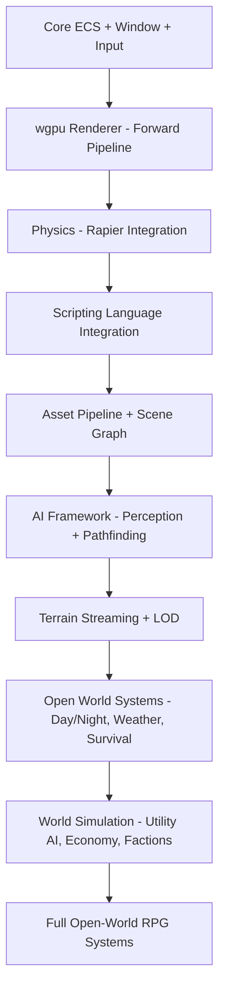
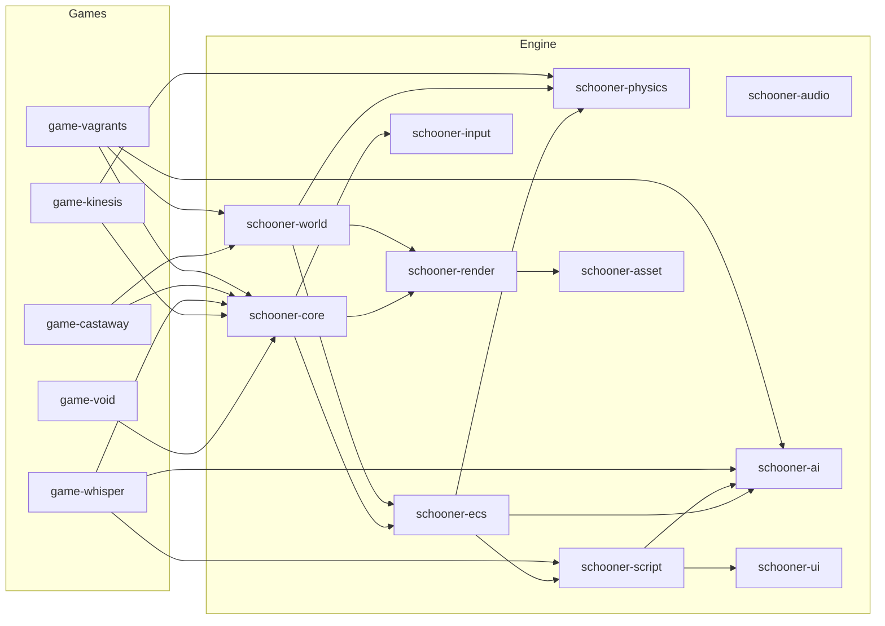

# Schooner Engine — Small Games Progression Plan

## Philosophy

Each game is both an **engine milestone** and a **game in its own right**. The early ones are tech demos that prove subsystems work. The later ones should be polished enough to ship. Every game inherits everything built before it — the engine grows monotonically.

The progression is designed around one principle: **each game adds exactly one major new dimension of complexity** while stress-testing everything built so far.

---

## Engine Subsystem Build Order

---

## The Games

### Game 0: The Void — Engine Bootstrap
**Genre:** Not a game. Interactive tech demo.
**What you see:** A lit 3D scene you can walk around in. Some cubes, a floor, maybe a skybox. First-person camera. WASD + mouse.

**Engine subsystems built:**
- [ ] Rust workspace structure — engine crate + game crate separation
- [ ] Custom ECS v1 — entities, components, systems, basic query API
- [ ] winit window creation + event loop
- [ ] wgpu initialization — device, surface, swap chain
- [ ] Forward rendering pipeline — vertex/fragment shaders, depth buffer
- [ ] Mesh rendering — load and draw simple geometry
- [ ] Camera system — first-person FPS camera with mouse look
- [ ] Input system — keyboard + mouse abstraction layer
- [ ] Basic transform components — position, rotation, scale
- [ ] Simple directional lighting — Blinn-Phong or similar
- [ ] Delta time, fixed timestep game loop

**Why this first:** You cannot build anything else without a window, a renderer, and an ECS. This forces you to solve the foundational problems — wgpu setup, shader compilation, the ECS query model — before any game logic enters the picture. Since GPU work is your growth area, starting here with the simplest possible scene lets you learn the pipeline without game complexity on top.

---

### Game 1: Kinesis — Physics Puzzle
**Genre:** First-person physics puzzle game. Think Portal meets Psi-Ops — you have telekinetic powers and use them to solve environmental puzzles. Grab objects, throw them, stack them, trigger mechanisms. Some puzzles involve destruction — collapse a wall to open a path, shatter a support to drop a bridge.

**What you see:** First-person. A series of test chambers or connected rooms. You can grab objects with a telekinesis force, push/pull them, rotate them in the air, and launch them. Puzzles require moving objects onto pressure plates, building bridges from debris, breaking through destructible walls, redirecting energy beams by positioning reflectors. Each chamber teaches a new mechanic, culminating in multi-step puzzles that combine them.

**Engine subsystems built:**
- [ ] Rapier physics integration — rigid bodies, colliders, joints, constraints
- [ ] Physics-ECS bridge — sync transforms between Rapier and ECS
- [ ] Collision events propagated through ECS
- [ ] Force application system — apply directional/radial forces to bodies from gameplay
- [ ] Constraint-based interaction — grab, hold, rotate physics objects with player input
- [ ] Destructible objects — break meshes into physics fragments on impact threshold
- [ ] Trigger volumes — detect entity presence in a region, fire ECS events
- [ ] Basic material system — different object types with different mass, friction, breakability
- [ ] Simple particle effects — impact sparks, debris dust, energy visuals
- [ ] Debug rendering — wireframe colliders, force vectors, trigger volumes
- [ ] Basic UI — puzzle state indicators, reticle, level transitions (Rust-side for now)
- [ ] Audio integration (rodio or kira) — impact sounds, ambient, positional audio basics
- [ ] Level/scene structure — load discrete levels, transition between them

**Why this game:** Physics is a dependency for almost everything after it — character controllers, object interaction, environmental simulation. A puzzle game is the right choice over a pure sandbox because: (1) it forces you to build **precise, controllable physics interactions** (grab, hold, throw, trigger), which are exactly the verbs your final RPG needs for object manipulation in the world, (2) puzzle design requires trigger systems and game-state logic, which lays groundwork for scripted events in Game 2, (3) the Portal-like structure of discrete test chambers is a natural fit for your current asset situation — clean geometric environments, no need for organic terrain yet, (4) destruction mechanics stress-test physics performance and teach you about mesh fragmentation, which carries forward to combat and world interaction.

**Releasable?** With enough clever puzzles and a coherent aesthetic, absolutely. Physics puzzle games have a dedicated audience. Even a short 1-2 hour experience works well on itch.io or Steam.

---

### Game 2: Whisper — Scripting + AI Foundations
**Genre:** First-person horror/stealth. A single large interior environment — an abandoned research facility, a sprawling mansion, or a deep mine. One or more entities patrol and hunt. You must explore, find key items, solve environmental puzzles, and escape.

**What you see:** Dark corridors lit by your flashlight. You hear footsteps that are not yours. You peek around corners. You hide behind objects and hold your breath. The entity searches rooms it heard noise from. Physics objects from Game 1 carry over — you can throw objects to distract, barricade doors, knock things over accidentally and alert the hunter.

**Engine subsystems built:**
- [ ] Scripting language integration — VM embedded in engine, Rust-to-script FFI bridge
- [ ] Script-driven game logic — item pickups, door triggers, puzzle sequences, win/lose conditions
- [ ] Script-driven UI — inventory screen, HUD elements, notes/documents rendered via scripting
- [ ] Hot-reload for scripts during development
- [ ] AI perception system — sight cones, hearing radius, memory of last-known position (ECS)
- [ ] AI state machines / behavior trees — patrol, investigate, search, chase, lose-interest (scripted)
- [ ] NavMesh generation or navigation grid for AI pathfinding
- [ ] Pathfinding — A* or similar, integrated with nav data
- [ ] 3D spatial audio — positional sound sources, attenuation, occlusion
- [ ] Lighting improvements — point lights, spot lights, shadow maps (at least one directional + one spot)
- [ ] Asset loading pipeline v1 — load meshes, textures, scenes from files (glTF or custom format)
- [ ] Scene serialization — save/load a level from data files
- [ ] Post-processing pass v1 — at minimum: gamma correction; stretch goal: basic fog, vignette

**Why this game:** This is where the scripting language enters the engine. Horror/stealth is the ideal vehicle because: (1) the core gameplay loop is simple — hide, explore, escape — so game logic complexity is manageable while you are debugging a new scripting integration, (2) it **demands** working AI that perceives and reacts to the player, which is the first real step toward your emergent simulation goal, (3) it reuses and extends the physics interactions from Game 1 — throwing distractions, barricading doors, knocking things over — validating that prior work composes well, (4) it forces you to build the asset pipeline because you need actual environments with authored atmosphere, (5) the AI here is finite-state (patrol/search/chase), which is the right starting complexity before utility AI. All game logic, AI behavior trees, and UI run in your scripting language — this game is the proving ground for script performance and ergonomics.

**Releasable?** Yes. Horror games have a strong indie market and a high scare-to-asset ratio. A tight 30-60 minute experience with strong atmosphere can do well.

---

### Game 3: Castaway — Open World + Survival
**Genre:** First-person survival on a medium-sized island. Gather resources, craft tools, build shelter and fortifications, survive escalating nightly hordes of creatures. Think The Forest meets They Are Billions — an island with exploration by day and base defense by night.

**What you see:** An island with forests, beaches, rocky hills, caves. Day-night cycle with dramatic lighting shifts. You gather wood and stone, craft axes and weapons, build walls and traps. Each night, creatures attack your base in waves — you must defend with weapons, traps, and fortifications. Between waves, you explore further, discover better resources and blueprints. The hordes grow larger and smarter as days pass.

**Engine subsystems built:**
- [ ] Terrain system v1 — heightmap-based terrain with splatmap texturing
- [ ] LOD system for terrain — near detail, far distance simplification
- [ ] Chunk-based world streaming — load/unload terrain chunks around the player
- [ ] Vegetation system — grass, trees (billboards or simple meshes at distance)
- [ ] Day-night cycle — sun/moon movement, sky color changes, basic atmospheric scattering
- [ ] Weather system — rain particles, fog density changes, wind affecting vegetation
- [ ] Water rendering — basic reflective/refractive water plane
- [ ] First-person character controller with physics — walk, run, jump, swim
- [ ] Inventory system (scripted) — item management, weight, stacking
- [ ] Crafting system (scripted) — recipe-based item combination
- [ ] Building/placement system — place walls, floors, traps; snap-based or freeform
- [ ] Resource gathering — interact with world objects (chop trees, mine rocks) with tool-dependent yield
- [ ] Creature AI — extends Game 2 AI with group behavior: pack tactics, flanking, targeting weak points in walls
- [ ] Horde/wave system (scripted) — spawn escalating waves, scale difficulty with day count
- [ ] Combat system v1 — melee swings, ranged projectiles, damage, knockback, creature death
- [ ] Trap mechanics — placed objects that trigger on creature contact (physics-based)
- [ ] Save/load full world state — terrain modifications, placed structures, inventory, day count

**Why this game:** This is the **first open-world game** and introduces terrain streaming — the core technical challenge for your final vision. A survival-with-hordes game is the right fit because: (1) it forces you to build the entire outdoor rendering pipeline (terrain, vegetation, water, sky, weather), (2) the build-and-defend loop is a natural stress-test for the building system and physics at scale (dozens of creatures hitting walls simultaneously), (3) escalating horde difficulty pushes you to optimize creature AI for larger group counts, directly preparing for the NPC-heavy simulation in Game 4, (4) the day-night cycle and weather are foundational for world atmosphere in every game after this, (5) the survival mechanics (crafting, resource gathering, building) are direct precursors to the final RPG's survival elements.

**Releasable?** Strong candidate. Survival games with base defense are a proven indie genre. Even a single well-designed island with 20+ nights of escalating difficulty can sustain a full game.

---

### Game 4: Vagrants — Living World Simulation
**Genre:** First-person open-world sandbox with deep emergent NPC simulation. A region with settlements, wilderness, factions, and NPCs who live autonomous lives. The player is an agent in this world — a mercenary taking contracts, a wandering influence, maybe even something inhuman — whose actions ripple through the simulation.

**Core concept:** The world runs without you. NPCs have needs, jobs, relationships, and goals. Factions control territory, trade resources, and wage conflicts. You take contracts from various persons and factions — escort a merchant, clear a bandit camp, assassinate a rival leader, deliver contraband. Every completed contract shifts the world: a cleared trade route makes goods cheaper in one town and a merchant guild more powerful; an assassination destabilizes a faction and emboldens its rivals; protecting a settlement lets it grow while neglected ones decline. You are not the hero — you are a catalyst. The world reacts to what you do, but also to what you don't do.

**Alternative player fantasy:** Instead of a human mercenary, the player could be a forest creature or spirit — a non-human entity whose presence and behavior shapes the world in stranger ways. The engine does not care what the player is; the simulation treats the player as just another agent.

**Engine subsystems built:**
- [ ] Utility AI system — NPCs evaluate possible actions based on needs, personality traits, and world context
- [ ] NPC needs simulation — hunger, rest, safety, wealth, social belonging
- [ ] Emergent daily routines — schedules arise from utility evaluation, not hard-coded timetables
- [ ] Faction system — reputation, controlled territory, inter-faction diplomacy and conflict
- [ ] Economy simulation — NPCs produce, consume, and trade goods; prices driven by supply/demand per settlement
- [ ] Relationship system — NPCs form opinions of each other and the player based on observed actions
- [ ] World consequence system — player actions (and inactions) propagate through economy, faction power, NPC safety
- [ ] Contract/task system (scripted) — emergent jobs generated from NPC and faction needs, not hand-authored quests
- [ ] Dialogue system (scripted) — context-aware conversation reflecting NPC state, relationships, faction stance, recent events
- [ ] NPC LOD simulation — full utility evaluation for nearby NPCs, simplified tick for distant ones
- [ ] Larger world scale — bigger terrain, more streaming chunks, distant terrain rendering
- [ ] Instanced rendering — handle many NPCs, buildings, objects efficiently
- [ ] Skeletal animation system — character models with walk/idle/work/fight/sleep animations
- [ ] Combat system v2 — extends Game 3 combat with NPC-vs-NPC fighting, group tactics, morale/flee
- [ ] Settlement system — NPCs build, maintain, and abandon structures based on faction health and resources
- [ ] Event/history log — the world tracks what happened, enabling NPCs to reference past events in dialogue

**Why this game:** This is the **heart of your engine's differentiator** — the living world simulation. Everything before was building toward having enough systems to support autonomous NPCs at scale. The mercenary/catalyst concept is ideal because: (1) it has no main quest — the simulation IS the content, which lets you focus entirely on AI and world-systems quality, (2) the contract system naturally demonstrates cause-and-effect: the player does something, the world changes in visible ways, (3) it directly tests whether your ECS + scripting architecture can handle hundreds of simulated agents running utility AI in script, (4) the economy and faction systems are exactly what the final RPG needs, (5) the "you are not the hero" design forces the simulation to be genuinely autonomous — it cannot fake it by only simulating when the player is looking.

**Releasable?** Yes, and potentially the most commercially interesting one. Kenshi proved this niche has a passionate, underserved audience hungry for living-world sandboxes.

---

### Game 5: The Final RPG
The target game. Inherits everything from Games 0-4 and adds:
- Character progression and RPG stat systems
- Deeper combat with RPG mechanics
- Advanced renderer — deferred shading, global illumination, volumetric atmosphere
- Larger world scale with more biome variety
- Full polish pass on all systems
- Survival elements integrated with the living-world simulation

Content and narrative design is deferred — it depends on what is learned from Games 0-4.

---

## Architecture Diagram — Engine Crate Structure

---

## Critical Design Decisions

### Resolved during Game 0 planning

- [x] **ECS storage model** — **Sparse-set primary**, with per-component change-detection hooks from day one. Dense-packed hot-path caches are a named future optimization layered on top when profiling justifies it in Game 3+. Rationale: the sparse-set shape is what the scripting language's "organism not castle" philosophy wants (entities as composable property sets), what Game 4's LOD hydration/dehydration needs structurally (O(1) add/remove per component, no archetype migration cost), and what reactive subscriptions (`when X changes ...`) bind onto naturally. Iteration cost is acceptable for Games 0–3; when it becomes the bottleneck, dense view caches close the gap without changing the storage contract that script sees.
- [x] **World coordinate system** — Y-up, right-handed. NDC depth 0..1 (wgpu default). Units: 1.0 = 1 meter. Reverse-Z deferred to Game 3 when outdoor depth precision starts to matter.
- [x] **Entity ID scheme** — `EntityId { index: u32, generation: u32 }`, 8 bytes, `Copy`. Generational index handles stale-reference detection. Named/stable string IDs for authored content live in a separate `HashMap<NameHash, EntityId>` registry, not baked into `EntityId`.
- [x] **Shader language** — WGSL only. Shaders loaded at runtime from `engine/shaders/*.wgsl` for development iteration. Hot-reload is a stretch goal.

### Open — to be resolved before or during the game that needs them

- [ ] **Scripting FFI model** *(decide during Game 2 planning)* — How do shik and Rust call each other? Stack-based VM with C-like FFI, direct function pointers, shared memory? Must be fast — hundreds of NPCs running utility AI in shik every tick. Constrained by shik's current implementation.
- [ ] **Component schema ownership (Rust vs shik)** *(decide during Game 2 planning)* — Rust owns engine-intrinsic components (Transform, Mesh, Camera, RigidBody) because the renderer and physics need them statically. Shik owns game-defined components (Health, Faction, Inventory). Shared schema description via Rust derive macro + first-class shik types needs detailed design.
- [ ] **Reactive cascade semantics** *(decide before Game 2 wires subscriptions)* — When a component change fires a subscription that mutates another component, does the cascade propagate synchronously (simple, debuggable, can frame-spike), deferred across ticks (smooth but laggy to the player), or budget-based (sophisticated, hard)? Current leaning: synchronous with a bounded recursion depth.
- [ ] **LOD continuity fidelity** *(decide during Game 4 planning)* — When a dehydrated NPC is rehydrated, full persistence (everyone simulated always — Dwarf Fortress), plausible illusion (generate a reasonable story — Skyrim), or a narrative-important hybrid (flagged figures get full persistence, background population gets plausible illusion)? Current leaning: hybrid.
- [ ] **Asset format** *(decide during Game 1 planning)* — glTF for meshes first (standard, well-tooled); custom binary only if glTF proves insufficient. Hot-reload strategy for development iteration TBD.
- [ ] **Relationship graph as first-class** *(parked, revisit Game 4)* — Flecs-style relationships as a core ECS concept, or keep modeling group membership via entity-ID fields on components? Parked until the need is concrete.

---

## Summary of Progression

| Game | Codename | New Major Dimension | Key Engine Milestone |
|------|----------|-------------------|---------------------|
| 0 | The Void | Rendering + ECS | Can draw 3D and iterate entities |
| 1 | Kinesis | Physics + Interaction | Controllable physics, triggers, destruction |
| 2 | Whisper | Scripting + AI v1 | Game logic in custom language, AI perceives and reacts |
| 3 | Castaway | Open World + Survival | Streaming terrain, outdoor rendering, hordes, building |
| 4 | Vagrants | Living Simulation | Autonomous NPCs with needs, economy, factions, consequences |
| 5 | Final RPG | Everything | RPG systems + polish on top of proven engine |

---

## Subsystem Reuse Across Games

This table shows how each engine subsystem is introduced in one game and reused/extended in later ones:

| Subsystem | Game 0 | Game 1 | Game 2 | Game 3 | Game 4 |
|-----------|--------|--------|--------|--------|--------|
| ECS (sparse-set storage) | **new** | reuse | reuse | extend | extend |
| Change-detection substrate | **new** | reuse | extend | reuse | extend |
| Renderer | **new** | extend | extend | extend | extend |
| Input | **new** | reuse | reuse | reuse | reuse |
| Physics | — | **new** | reuse | extend | reuse |
| Audio | — | **new** | extend | reuse | reuse |
| Scripting (shik) | — | — | **new** | reuse | reuse |
| Reactive cascade engine | — | — | **new** | reuse | extend |
| AI | — | — | **new** | extend | extend |
| Asset Pipeline | — | **new (min)** | extend | reuse | reuse |
| Terrain/World | — | — | — | **new** | extend |
| Dense-view hot-path caches | — | — | — | **new** (if needed) | extend |
| Survival Systems | — | — | — | **new** | — |
| Simulation/Economy | — | — | — | — | **new** |
