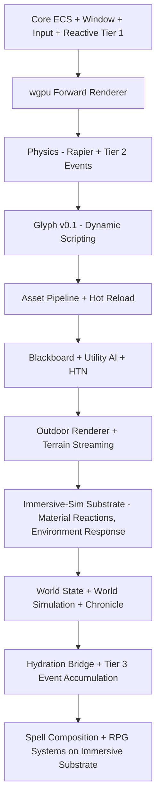
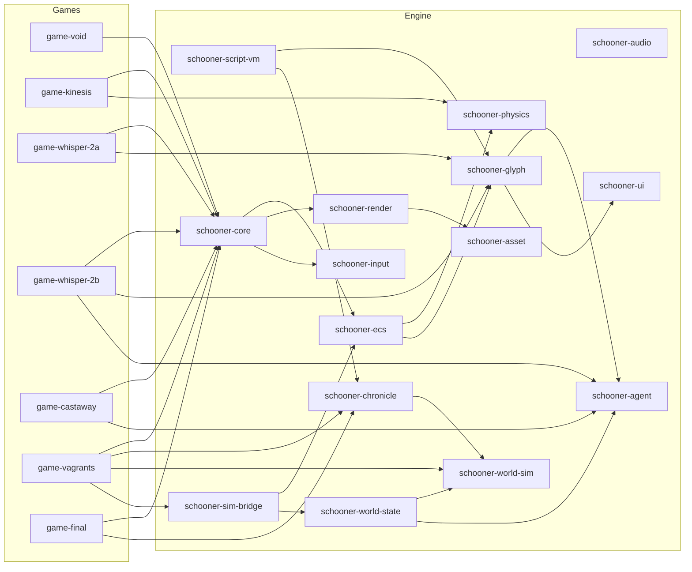

# Schooner Engine — Small Games Progression Plan

## Philosophy

Each game is both an **engine milestone** and a **game in its own right**. The early ones are tech demos that prove subsystems work. The later ones should be polished enough to ship. Every game inherits everything built before it — the engine grows monotonically.

The progression is designed around one principle: **each game adds exactly one major new dimension of complexity** while stress-testing everything built so far.

The engine's reason for existence — the four pillars that justify every architectural decision — and the long-form vision for each subsystem live in `plans/architecture/*.md`. This plan is the *staging*: which game introduces what, in what order, and why. The architecture docs are the *what* and *why*; this plan is the *when*.

---

## Engine Subsystem Build Order

---

## The Games

### Game 0: The Void — Engine Bootstrap *(complete)*
**Genre:** Not a game. Interactive tech demo.
**What you see:** A lit 3D scene you can walk around in. A floor and a 3×3 grid of cubes under one directional light. First-person camera. WASD + mouse. F1 toggles a debug overlay with FPS, frame time, entity count, camera position, and an in-overlay puffin scope viewer.

**Engine subsystems built:**
- [x] Rust workspace structure — `schooner-engine` lib crate + `game-void` bin crate + `bench-ecs` benchmark crate
- [x] Custom ECS v1 — entities (generational `EntityId`), components, systems, `Query` (1/2/3-tuples + `Without<T>` filter), `Res<T>` / `ResMut<T>`, `IntoSystem` reflection
- [x] **Sparse-set storage with per-component change-detection ticks (Tier 1 substrate)** — `Mut<T>` smart pointer bumps `last_mutation_tick` on `DerefMut`; `World::changed_since::<T>(tick)` iterator; substrate present, no consumers yet
- [x] winit window creation + event loop with resize / focus / close handling
- [x] wgpu initialization — device, surface (`Surface<'static>` via `Arc<Window>`), swap chain, depth texture, surface-loss/outdated recovery
- [x] Forward rendering pipeline — WGSL shaders loaded at runtime from `engine/shaders/`, depth write, back-face cull, sRGB swap chain
- [x] Mesh rendering — built-in cube + plane meshes registered eagerly at `MeshHandle::CUBE` / `::PLANE`; per-draw model uniform via dynamic offset (no `PUSH_CONSTANTS` feature gate)
- [x] Camera system — first-person FPS camera (`fps_look`, `fps_move`); mouse capture on focus, Esc toggle, release on focus loss
- [x] Input system — keyboard + mouse state with `is_down` / `just_pressed` / `just_released`, mouse delta, cursor-grab control
- [x] Basic transform components — `Transform { translation, rotation, scale }` at engine root (shared scene-graph primitive, not under `render/`)
- [x] Simple directional lighting — Blinn-Phong with one directional light + ambient
- [x] Delta time + fixed-timestep game loop — accumulator pattern in `App::tick`, `Update` and `FixedUpdate` stages wired from day one
- [x] **Render stage** in the scheduler — third stage promoted in Phase H when egui added a second render-side system; uniform `current_tick`-bump rule across all stages
- [x] **egui debug overlay** — FPS / ms (60-frame ring buffer), entity count, camera position; F1 toggles visibility
- [x] **puffin CPU profiler** with scopes in `App::tick`, every Schedule stage, `render_frame` and its sub-phases; custom in-overlay scope viewer (no `puffin_egui` due to version-pairing mismatch)
- [x] `env_logger` wiring with three-tier filter precedence (`RUST_LOG` → fallback → default)
- [x] GitHub Actions CI matrix on macOS / Linux / Windows running `cargo check` with `Swatinem/rust-cache` and pinned MSRV 1.95
- [x] Engine architecture README (idea-level) at `crates/schooner-engine/README.md`

**Status:** 7 of 8 Done Bar items met (see `plans/game0-plan.md` §1.6). The outstanding item is `cargo run -p game-void` verification on Windows and Linux — gated on developer access to those OSes. CI's `cargo check` matrix is the leading-indicator stand-in.

**Why this first:** You cannot build anything else without a window, a renderer, and an ECS. This forces you to solve the foundational problems — wgpu setup, shader compilation, the ECS query model — before any game logic enters the picture. Since GPU work is your growth area, starting here with the simplest possible scene lets you learn the pipeline without game complexity on top.

---

### Game 1: Kinesis — Physics Puzzle
**Genre:** First-person physics puzzle game. Think Portal meets Psi-Ops — you have telekinetic powers and use them to solve environmental puzzles. Grab objects, throw them, stack them, trigger mechanisms. Some puzzles involve destruction — collapse a wall to open a path, shatter a support to drop a bridge.

**What you see:** First-person. A series of test chambers or connected rooms. You can grab objects with a telekinesis force, push/pull them, rotate them in the air, and launch them. Puzzles require moving objects onto pressure plates, building bridges from debris, breaking through destructible walls, redirecting energy beams by positioning reflectors. Each chamber teaches a new mechanic, culminating in multi-step puzzles that combine them.

**Engine subsystems built:**

*Physics + interaction (the core dimension):*
- [ ] Rapier physics integration — rigid bodies, colliders, joints, constraints
- [ ] Physics-ECS bridge — sync transforms between Rapier and ECS each fixed-update
- [ ] Collision events — **first Tier 2 cross-layer event channel**: physics publishes contacts; gameplay systems consume on the next frame
- [ ] Force application system — directional / radial forces from gameplay onto bodies
- [ ] Constraint-based interaction — grab, hold, rotate physics objects with player input
- [ ] Destructible objects — break meshes into physics fragments on impact threshold
- [ ] Trigger volumes — detect entity presence in a region, fire Tier 2 events
- [ ] Basic material system (physics) — mass, friction, restitution, breakability per material kind

*Asset pipeline v0 (the minimum to stop hardcoding meshes):*
- [ ] **glTF mesh loader** — load authored meshes from disk into `MeshRegistry`; replaces the Game 0 hardcoded cube/plane workflow for anything that isn't a debug primitive
- [ ] **Texture loader** — load PNG/KTX textures from disk; bind into the existing forward shader's albedo slot
- [ ] **Manual reload** — a developer-facing key combo or CLI flag that re-reads asset files; no file watcher yet (that's Game 2A's v1)
- [ ] **Level/scene loader** — load a discrete level from a glTF scene file (or a small custom scene-list format if glTF scenes prove awkward); levels declare their meshes, textures, light, and entity layout
- [ ] **Level transitions** — tear down current level entities, load next level; reuses the loader

*Supporting systems:*
- [ ] Simple particle effects — impact sparks, debris dust, energy visuals (CPU-driven for now)
- [ ] Debug rendering — wireframe colliders, force vectors, trigger volumes (overlay-style, behind a debug flag)
- [ ] Basic UI — puzzle-state indicators, reticle, level-transition prompt (Rust-side for now; Glyph-driven UI is Game 2A)
- [ ] Audio integration (`rodio` or `kira`) — impact sounds, ambient, positional audio basics

**Why this game:** Physics is a dependency for almost everything after it — character controllers, object interaction, environmental simulation. A puzzle game is the right choice over a pure sandbox because: (1) it forces you to build **precise, controllable physics interactions** (grab, hold, throw, trigger), which are exactly the verbs the final RPG needs for object manipulation in the world; (2) puzzle design requires trigger systems and game-state logic, which lays groundwork for scripted events in Game 2A; (3) the Portal-like structure of discrete test chambers is a natural fit for the current asset situation — clean geometric environments, no need for organic terrain yet; (4) destruction mechanics stress-test physics performance and teach you about mesh fragmentation, which carries forward to combat and world interaction; (5) the asset pipeline v0 lands here because Game 1 is the first game with *authored* content beyond Game 0's procedural primitives — you can no longer get away with hardcoded meshes, but you also do not yet need hot reload or a scene editor, so v0 stays tight.

**Releasable?** With enough clever puzzles and a coherent aesthetic, absolutely. Physics puzzle games have a dedicated audience. Even a short 1-2 hour experience works well on itch.io or Steam.

---

### Game 2 — Whisper: Scripting + AI Foundations (split into 2A and 2B)

Game 2 is split. The original single-game scope packed scripting VM, FFI, hot reload, asset pipeline, AI perception, behaviour trees, navigation, spatial audio, and post-processing into one game — three games of work. Splitting scripting (2A) from AI (2B) lets each new system feel its own pain before stacking the next.

#### Game 2A — Whisper: Scripted Horror

**Genre:** First-person scripted-horror. A single large interior environment — an abandoned research facility, a sprawling mansion, or a deep mine. No autonomous AI enemy yet; horror is built from scripted scares, atmosphere, and environmental puzzles. The player explores, finds key items, solves puzzles, escapes.

**What you see:** Dark corridors lit by your flashlight. Doors slam. Lights flicker on cue. Notes and journals tell a story. Objects move when you turn your back. Physics objects from Game 1 carry over — you can throw objects, barricade doors, knock things over.

**Engine subsystems built:**
- [ ] Glyph v0.1 — bytecode VM, S-expression parser, dynamic typing, Rust ↔ Glyph FFI
- [ ] Hot reload for scripts (file watcher → recompile → swap module, in-flight state preserved where possible)
- [ ] Script-driven game logic — item pickups, door triggers, puzzle sequences, scripted scares, win/lose conditions
- [ ] Script-driven UI — inventory, HUD, notes/journals, dialogue (no NPC yet)
- [ ] **Asset pipeline v1** — extends Game 1's v0 with: file-watcher-driven hot reload of meshes, textures, and shaders; richer scene format (entity layouts, component overrides, light placements); broader texture format support if needed
- [ ] Scene serialization — save/load full level state (placed objects, puzzle state, mid-level checkpoints) to data files
- [ ] Lighting upgrade — cascaded shadow maps for the sun, one spot light for the flashlight, point/spot light support
- [ ] Post-process pipeline lands in full — tone curve with shadow lift, warm colour grade, warm height fog, vignette (per `architecture/rendering.md`)
- [ ] Foliage translucency shader written and exercised on a few interior plants — keeps the shader path real for Game 3
- [ ] 3D spatial audio v1 — positional sources, attenuation
- [ ] Tier 2 cross-layer event queue formalised (collision events from Game 1 generalised)

**Why this split:** Scripting is the new dimension. Horror is the right vehicle because the loop (hide, explore, escape) is simple enough to debug a new VM under, while the atmosphere demands the asset pipeline and post-process work. No AI yet — the script-engine boundary is hard enough on its own.

#### Game 2B — Whisper: The Hunter

**Genre:** Same environment as 2A, now with one or more autonomous entities that patrol and hunt. The horror sharpens; you can be found.

**What you see:** Footsteps that aren't yours. The entity searches rooms it heard noise from. You hide; it investigates; it gives up; you breathe. Throw an object to distract; barricade a door to stall.

**Engine subsystems built:**
- [ ] Blackboard system — the agent's perception of itself and its situation (Rust-owned, populated by perception and script)
- [ ] Utility AI v1 — simple, 4 candidate goals (patrol / investigate / search / chase), Glyph-authored scoring functions
- [ ] HTN planner — Glyph-authored task definitions; the planner the same one that scales to Game 3 creatures and Game 4 NPC routines
- [ ] AI perception — sight cones, hearing radius, memory of last-known position (ECS, feeds blackboard)
- [ ] NavMesh generation + A* pathfinding
- [ ] AI budget scheduler — batched processing on the main thread; structured for future thread split (command buffer pattern in place from day one)
- [ ] Skin shading variant — character-tier material (diffuse + normal + spec mask + cheap warm-wrap) — exercised on the hunter
- [ ] Spatial audio extended — occlusion, the hunter's footsteps must read positionally

**Why a single AI architecture across all later games:** The choice to skip behaviour trees and go straight to blackboard + utility + HTN is deliberate. State machines and behaviour trees are a different paradigm than utility AI; building BTs in Game 2 and then rewriting for Game 4's utility-driven NPCs is wasted work. A 4-goal utility evaluator looks like an FSM from the outside but is the right scaffold underneath. Game 3 extends it with group goals; Game 4 extends it with rich need-driven scoring; the bones never change.

**Releasable?** Both 2A and 2B are releasable. 2A is a 30–60 min scripted-horror experience; 2B adds the AI antagonist for a tighter survival-horror loop.

---

### Game 3: Castaway — Open World + Survival + Immersive-Sim Foundations
**Genre:** First-person survival on a medium-sized island. Gather resources, craft tools, build shelter, survive escalating nightly hordes — but the world *responds*. Wood is wet after rain and resists igniting. A torch dropped in dry grass spreads. Iron tools rust in salt air. Creatures react to fire, to wet ground, to noise. The survival/craft loop is the surface; the immersive-sim substrate is what's actually being built.

**What you see:** An island with forests, beaches, rocky hills, caves. Day-night cycle with dramatic lighting shifts. You gather wood and stone, craft axes and weapons, build walls and traps. Each night, creatures attack your base in waves. You learn the rules of the world — *fire spreads, wet things don't burn, ice forms in cold caves, animals follow scent* — and the world honours those rules consistently. The hordes grow more dangerous because the player learns the system, not because numbers scale.

**Engine subsystems built:**

*Outdoor rendering (per `architecture/rendering.md`):*
- [ ] Terrain shader — heightmap with splatmap blending, near/far LOD
- [ ] Chunk-based world streaming — load/unload terrain chunks around the player (IO thread)
- [ ] Vegetation pipeline — hero / shell / imposter LOD chain with crossfade; vertex-shader wind from a global wind field
- [ ] Day-night cycle — sun/moon movement, sky tint, fog colour modulation through the day
- [ ] Weather — rain particles, fog density shifts, wind variation
- [ ] Water rendering — planar reflection + simple refraction
- [ ] Light shafts — screen-space or coarse volumetric (decided at prototype time)
- [ ] Screen-space contact shadows
- [ ] Optional cheap SSAO — kept only if profiling earns it

*Immersive-sim substrate (the foundations Game 5's spell composition will build on):*
- [ ] **Material reaction matrix** — components carry material tags (Wood, Metal, Stone, Flesh, Cloth, Grass, Ice, Water, …) and reaction rules (`Fire + Wood → Burning`, `Water + Burning → Steam`, `Cold + Water → Ice`). Authored in Glyph; consumed via Tier 1 reactive subscriptions.
- [ ] **Status-effect framework** — components like `Burning`, `Wet`, `Frozen`, `Bleeding`, `Stunned` that flicker on and off; durations; intensity; stacking rules; visual/audio cues hooked to component change events.
- [ ] **Environment response** — terrain and props carry queryable state (grass is dry/wet, ground is muddy after rain, wood is dry/damp). The world reacts to weather and to the player's actions.
- [ ] **Propagation systems** — fire spreads to flammable neighbours under conditions; wet propagates by contact; freeze propagates by proximity to cold sources. Each is a small Glyph-authored rule set running on Tier 1 events.
- [ ] **Heat / temperature field (coarse)** — local areas have a temperature value affecting freeze/melt behaviour, used by torches, fires, cold caves, weather.
- [ ] **Noise / scent fields** — perception-relevant world state that creature AI consumes (the same agent layer from 2B).

*Survival surface (the gameplay layer that exercises the substrate):*
- [ ] First-person character controller with physics — walk, run, jump, swim, climb
- [ ] Inventory (Glyph) — items carry material tags and react accordingly
- [ ] Crafting (Glyph) — recipes; tool-dependent yield; tools wear and rust
- [ ] Building / placement — walls, floors, traps; snap-based or freeform; structures inherit material reactions (wooden walls burn)
- [ ] Resource gathering — chop trees, mine rocks; uses the material/reaction substrate
- [ ] Creature AI — extends 2B agent layer with **group goals on a shared pack blackboard**: pack tactics, flanking, targeting structural weak points; perception consumes the noise/scent fields
- [ ] Horde / wave system (Glyph) — escalating waves
- [ ] Combat v1 — melee, ranged projectiles, damage typed by material (slashing, blunt, fire, cold, etc.)
- [ ] Trap mechanics — physics-based, materially reactive (a fire trap ignites the wet creature only if it dries first)
- [ ] Save/load — terrain mods, structures, inventory, world state

**Why this game:** This is the first open-world game *and* the game that lays the immersive-sim substrate Game 5's spell system will compose on. The survival/craft surface is the playable shell; the substrate underneath is the engine's promise to be alive. Every reaction rule, every propagation system, every material tag built here will be reused by spells, by enemy abilities, by environmental hazards in later games. Building these foundations in a survival game is right because: (1) the survival genre demands the player learn world rules, which forces the rules to be *consistent* (impossible to ship if they aren't); (2) base defence stress-tests the propagation systems at scale (a fire reaching the wooden walls); (3) the rules themselves are simple enough to author and tune in this game, hard enough that they break if the architecture is wrong; (4) the agent layer's group behaviour earns its complexity here; (5) the renderer's full outdoor pipeline lands here.

**Releasable?** Strong candidate. The immersive-sim substrate is a marketable feature in a survival game (rare in the genre — most survival games have flat, non-reactive rules). A single well-designed island with materially-reactive systems can sustain a full game.

---

### Game 4: Vagrants — Living World Simulation
**Genre:** First-person open-world sandbox with deep emergent NPC simulation. A region with settlements, wilderness, factions, and NPCs who live autonomous lives. The player is one agent in this world — a mercenary taking contracts, a wandering influence, maybe even something inhuman — whose actions ripple through the simulation.

**Core concept:** The world runs without you. NPCs have needs, jobs, relationships, and goals. Factions control territory, trade resources, and wage conflicts. You take contracts from various persons and factions — escort a merchant, clear a bandit camp, assassinate a rival leader, deliver contraband. Every completed contract shifts the world: a cleared trade route makes goods cheaper in one town and a merchant guild more powerful; an assassination destabilises a faction and emboldens its rivals. You are not the hero — you are a catalyst. The world reacts to what you do, but also to what you don't do.

**Alternative player fantasy:** Instead of a human mercenary, the player could be a forest creature or spirit — a non-human entity whose presence shapes the world in stranger ways. The engine does not care what the player is; the simulation treats the player as just another agent.

**Engine subsystems built:**

*The full layered architecture goes live for the first time (per `architecture/overview.md`):*
- [ ] **World Database (Layer 1)** — relational store of characters, settlements, factions, titles, claims, marriages, vassalage, opinions, trade routes, history. Queried by Chronicle, read by the agent layer, bridged into the ECS by hydration. (`architecture/world-state.md`)
- [ ] **Chronicle v1.0 (Layer 2)** — declarative rule language compiled to indexed query plans. Statically typed from day one. Hot reload. Trigger → weight → effect grammar. World-thread evaluation at game-day and game-month tick rates, **independent of player location and NPC hydration state**. (`architecture/chronicle.md`)
- [ ] **Background-simulation tick** — engine code in Layer 2, distinct from Chronicle. Advances dehydrated NPCs by their authored schedule and current job (location, work output, inventory deltas, settlement aggregates) at game-hour or game-day resolution. Runs on the world thread sequentially with Chronicle's tick. (`architecture/world-state.md`)
- [ ] **World Simulation engine** — the runtime that ties Chronicle and the background tick together, advances economy, balances faction power, processes succession and migration, accumulates history.
- [ ] **Hydration Bridge** — translates between Layer 1 records and Layer 4 ECS entities as the player moves through the world. Spawn-and-despawn at zone boundaries. Catch-up reconstruction for plausible micro-state when the player returns after long absence. Re-syncs blackboard slots from Layer 1 when Chronicle rules fire on hydrated characters.
- [ ] **LOD continuity strategy: narrative-important hybrid** — story-flagged characters (rulers, quest-givers, player-bonded NPCs) get full state persistence across hydration; background population gets plausible reconstruction. Background-tick resolution differs by tier as well.
- [ ] **Tier 3 event accumulation** — facts about the world accumulate in the database and become queryable conditions for Chronicle rules ("three NPCs died in this territory this month").
- [ ] **World thread** formalised; AI thread split out of the main thread. Command-buffer pattern (already in place from Game 2B) carries the load.

*Agent layer extended:*
- [ ] Utility AI extended — full need-driven scoring (hunger, rest, safety, wealth, social) with personality weights
- [ ] Emergent daily routines from utility evaluation, not hard-coded schedules
- [ ] Relationship-aware behaviour — NPCs form opinions of each other and the player based on observed actions, mediated through Layer 1 opinion tables
- [ ] NPC LOD scheduler — full utility evaluation for nearby NPCs, simplified tick for distant ones, dehydration for NPCs outside loaded chunks

*Glyph v1.0:*
- [ ] Hygienic macros (driven by spell-composition needs surfaced in Game 3)
- [ ] Refinement types on bounded domain values (opinion ranges, faction standings, etc.)
- [ ] ECS queries embedded in the language with the compiler emitting specialised opcodes

*Game-systems surface:*
- [ ] Faction system (Layer 1 + Chronicle) — reputation, territory, diplomacy, conflict
- [ ] Economy simulation — production, consumption, trade flow, supply-demand pricing per settlement
- [ ] Contract / task system (Glyph) — emergent jobs from NPC and faction needs, not hand-authored quests
- [ ] Dialogue system (Glyph) — context-aware, references Layer 1 state and recent history
- [ ] Settlement system — NPCs build, maintain, abandon structures based on faction health
- [ ] Combat v2 — NPC vs NPC, group tactics, morale, flee; reuses Game 3's material reactions
- [ ] Skeletal animation — character meshes with walk/idle/work/fight/sleep
- [ ] Instanced rendering — many NPCs, buildings, objects rendered efficiently
- [ ] Larger world scale — bigger terrain, more streaming chunks, distant terrain rendering

**Why this game:** This is the heart of the engine's differentiator — the living world simulation. Everything before was building toward having enough systems to support autonomous NPCs at scale. The mercenary/catalyst concept is ideal because: (1) it has no main quest — the simulation *is* the content, which lets the focus stay on AI and world-systems quality, (2) the contract system naturally demonstrates cause-and-effect, (3) it directly tests whether the ECS + Chronicle + agent architecture can handle hundreds of simulated NPCs at scale, (4) the economy and faction systems are exactly what the final RPG needs, (5) the "you are not the hero" design forces the simulation to be genuinely autonomous — it cannot fake it by only simulating when the player is looking.

**Releasable?** Yes, and potentially the most commercially interesting one. Kenshi proved this niche has a passionate, underserved audience hungry for living-world sandboxes.

---

### Game 5: The Final RPG
The target game. Inherits everything from Games 0–4 and adds:

- **Immersive spell composition** — spells defined in Glyph as compositions of elemental rules over the material/reaction substrate built in Game 3. A fireball ignites flammables, evaporates water on wet enemies, cracks ice. Spell components combine in ways the engine cannot enumerate ahead of time. This is the immersive-sim payoff the previous games made possible.
- **Character progression** — RPG stat systems, skill trees, equipment, levelling.
- **Deeper combat** — RPG mechanics layered onto the existing combat system; the material/reaction substrate carries through.
- **Larger world** — more biome variety, more settlements, more factions, longer history.
- **Full polish pass** on every system.
- **Survival elements** integrated with the living-world simulation — the immersive-sim substrate from Game 3 meeting the simulated world from Game 4.

**No new layers, no new languages, no new renderer.** The renderer is finished in Game 3 (forward, MSAA, two material tiers, fixed post-pipeline — see `architecture/rendering.md`). The architecture is finished in Game 4. Game 5 is the polish-and-content game; it uses what exists rather than extending it.

Explicitly **not** building in Game 5: deferred rendering, global illumination, volumetric atmosphere beyond what Game 3 already has. These are exclusions per the rendering vision; refusing to build them is part of how we ship.

Content and narrative design is deferred — it depends on what is learned from Games 0–4.

---

## Architecture Diagram — Engine Crate Structure

The crate boundaries above are an aspiration, not a Game 0 commitment. Through Games 0–1 the engine ships as a single `schooner-engine` crate with internal module boundaries that match this graph. Crates extract when extraction earns its keep — typically when a second consumer appears or compile times demand it.

---

## Critical Design Decisions

### Resolved

- [x] **The four engine pillars** — alive world, tailored not generic, dev ergonomics, organism not castle. The framing every architecture decision is judged against. (`architecture/overview.md`)
- [x] **Layered world architecture** — five layers (World State, World Simulation, Agent Behavior, Local Simulation/ECS, Reactive Event Backbone). Naming is locked; full implementation lands in Game 4. (`architecture/overview.md`)
- [x] **Two-language strategy** — Glyph for procedural gameplay, Chronicle for declarative world rules. One shared VM with two frontends. Glyph staged dynamic→typed→expressive (G2A→G3→G4); Chronicle designed in G3, built in G4, statically typed from day one. (`architecture/glyph.md`, `architecture/chronicle.md`, `architecture/language-binding.md`)
- [x] **ECS storage model** — sparse-set primary, with per-component change-detection ticks from day one. Dense-packed hot-path caches are a named Game 3+ optimisation if profiling demands. Rationale: organism scripting philosophy, immersive-sim status-effect churn, reactive subscriptions, runtime composition. Hydration is spawn/despawn across the layer boundary, so archetype migration is not the load-bearing argument; the others are. (`architecture/ecs.md`)
- [x] **Reactive event backbone — three tiers**. Tier 1 (component change detection within Layer 4): substrate already in Game 0 ECS. Tier 2 (cross-layer typed queues): first appears in Game 1 with collision events; formalised in Game 2A. Tier 3 (world event accumulation for Chronicle queries): Game 4. Cascade semantics: synchronous within a frame with bounded recursion depth.
- [x] **AI architecture: Blackboard + Utility AI + HTN**, single paradigm from Game 2B onward. No separate "behaviour tree phase" that gets thrown away. Game 3 extends with group goals on a shared pack blackboard; Game 4 extends with rich need-driven scoring.
- [x] **Component schema ownership** — Rust owns engine-intrinsic components (Transform, Mesh, Camera, RigidBody, Collider, AnimationState, NavAgent, AudioSource). Glyph owns game-defined components (Health, Faction, Inventory, Burning, Wet, …). Chronicle does not own components; it queries the world database. Shared schema description is the contract. (`architecture/language-binding.md`)
- [x] **Hot reload is a first-class commitment**, not a stretch goal — for shaders, assets, Glyph scripts, and Chronicle rules. Pillar 3 made concrete. Reload failures are non-fatal; previous version keeps running.
- [x] **LOD continuity fidelity — narrative-important hybrid**. Story-flagged characters (rulers, quest-givers, player-bonded NPCs) get full state persistence across hydration; background population gets plausible reconstruction from world database state plus generated micro-state. (`architecture/world-state.md`)
- [x] **Threading: split along layer boundaries, not subsystem boundaries**. Single-threaded for Games 0–1. Game 2B writes thread-ready code (command-buffer pattern, no shared mutable state between agent layer and ECS) even though it runs single-threaded. AI thread splits in Game 3 if profiling demands. World thread arrives in Game 4 with Chronicle.
- [x] **Rendering aesthetic: "memory of a real place"** — Witcher 1 character fidelity, Gothic 2 mood, dreamy + grounded. Forward rendering permanently (no deferred even in Game 5). MSAA, never TAA. Foliage translucency. Hero / shell / imposter LOD for vegetation. Two material tiers (world / character). Vertex-shader wind. Fixed post-pipeline (tone curve + warm grade + warm height fog + vignette). No PBR, no GI, no SSR, no film grain. (`architecture/rendering.md`)
- [x] **World coordinate system** — Y-up, right-handed. NDC depth 0..1 (wgpu default). Units: 1.0 = 1 metre. Reverse-Z deferred to Game 3 when outdoor depth precision starts to matter.
- [x] **Entity ID scheme** — `EntityId { index: u32, generation: u32 }`, 8 bytes, `Copy`. Generational index handles stale-reference detection. Named/stable string IDs for authored content live in a separate registry resource, not baked into `EntityId`.
- [x] **Shader language** — WGSL only. Shaders loaded at runtime for development iteration; hot-reload arrives with the asset pipeline in Game 2A.

### Open — to be resolved before or during the game that needs them

- [ ] **Asset format** *(decide during Game 1 planning, build in Game 2A)* — glTF for meshes first; custom binary only if glTF proves insufficient. Hot-reload strategy is committed; the file watcher and reload semantics are detailed during Game 2A planning.
- [ ] **Glyph FFI binding mechanism** *(decide during Game 2A planning)* — exact wire format between Rust and the bytecode VM. Constrained by performance (hundreds of NPCs running utility AI in Glyph every agent tick) and by hot-reload semantics.
- [ ] **Cascade depth and budget** *(decide during Game 2A wiring of Tier 1 reactive)* — synchronous within a frame is decided; the specific recursion-depth cap and budget-overrun behaviour are tuned when real consumers exist.
- [ ] **Light-shaft technique for Game 3** *(decide during Game 3 prototyping)* — screen-space god rays vs coarse volumetric pass. Both are cheap; choice is aesthetic + profiling.
- [ ] **SSAO inclusion in Game 3** *(decide during Game 3 prototyping)* — included only if it pulls its weight. Hemisphere ambient + contact shadows may be enough.
- [ ] **Relationship graph as first-class ECS concept** *(parked, revisit Game 4)* — Flecs-style relationships in the ECS, or keep modelling via entity-ID fields and rely on Layer 1 for the relational queries? Parked until the need is concrete; current leaning is to keep it out of the ECS because Layer 1 is where relations live.
- [ ] **JIT for Glyph** *(parked, revisit Game 4 if profiling forces it)* — bytecode VM with specialised opcodes is the floor; JIT is the ceiling if the floor is not enough.

---

## Summary of Progression

| Game | Codename | New Major Dimension | Key Engine Milestone |
|------|----------|---------------------|----------------------|
| 0 | The Void | Rendering + ECS | Can draw 3D and iterate entities; reactive Tier 1 substrate in place |
| 1 | Kinesis | Physics + Interaction | Controllable physics, triggers, destruction; first Tier 2 events |
| 2A | Whisper: Scripted | Glyph language + asset pipeline | Game logic and UI in Glyph; hot reload; full post-process pipeline |
| 2B | Whisper: The Hunter | Agent layer foundations | Blackboard + Utility AI + HTN; perception + navigation; character material tier |
| 3 | Castaway | Open world + immersive-sim substrate | Streaming terrain, outdoor renderer, material reactions, propagation systems, group AI |
| 4 | Vagrants | Living simulation (full layered architecture) | World State + Chronicle + hydration bridge; world thread; Glyph v1.0 |
| 5 | Final RPG | Spell composition + RPG systems | Immersive spells composing on Game 3's substrate; progression; polish |

---

## Subsystem Reuse Across Games

| Subsystem | G0 | G1 | G2A | G2B | G3 | G4 | G5 |
|-----------|----|----|-----|-----|----|----|----|
| ECS (sparse-set storage) | **new** | reuse | reuse | reuse | extend | extend | reuse |
| Change-detection (Tier 1) | **new** | reuse | extend | reuse | reuse | reuse | reuse |
| Cross-layer events (Tier 2) | — | **new** | extend | extend | extend | extend | reuse |
| Forward renderer | **new** | extend | extend | reuse | **major extend** | extend | reuse |
| Post-process pipeline | — | — | **new** | reuse | extend | reuse | reuse |
| Material tiers (world/character) | — | — | partial | **new** | extend | reuse | reuse |
| Foliage translucency | — | — | **new** (test) | reuse | extend | reuse | reuse |
| Hero/shell/imposter vegetation | — | — | — | — | **new** | reuse | reuse |
| Input | **new** | reuse | reuse | reuse | reuse | reuse | reuse |
| Physics (Rapier) | — | **new** | reuse | reuse | extend | reuse | reuse |
| Audio | — | **new** | reuse | extend | reuse | reuse | reuse |
| Asset pipeline (v0 minimal) | — | **new** | reuse | reuse | reuse | reuse | reuse |
| Asset pipeline v1 (hot reload + scenes) | — | — | **new** | reuse | extend | reuse | reuse |
| Glyph v0.1 (dynamic) | — | — | **new** | extend | — | — | — |
| Glyph v0.5 (typed) | — | — | — | — | **new** | extend | — |
| Glyph v1.0 (macros + refinement) | — | — | — | — | — | **new** | extend |
| Chronicle | — | — | — | — | design | **new** | extend |
| Shared script VM | — | — | **new** | reuse | reuse | reuse | reuse |
| Blackboard | — | — | — | **new** | extend | extend | reuse |
| Utility AI | — | — | — | **new** | extend | extend | reuse |
| HTN planner | — | — | — | **new** | extend | extend | reuse |
| Perception + NavMesh | — | — | — | **new** | extend | reuse | reuse |
| AI budget scheduler | — | — | — | **new** | extend | extend | reuse |
| Terrain + streaming | — | — | — | — | **new** | extend | reuse |
| Day/night + weather | — | — | — | — | **new** | reuse | reuse |
| Material reactions / propagation | — | — | — | — | **new** | reuse | extend |
| Status-effect framework | — | — | — | — | **new** | reuse | extend |
| Dense-view caches | — | — | — | — | **new** (if needed) | extend | reuse |
| World State (Layer 1) | — | — | — | — | — | **new** | reuse |
| Background-simulation tick | — | — | — | — | — | **new** | reuse |
| World Simulation (Layer 2) | — | — | — | — | — | **new** | extend |
| Hydration bridge | — | — | — | — | — | **new** | reuse |
| Tier 3 event accumulation | — | — | — | — | — | **new** | reuse |
| Profiling (puffin) | **new** | reuse | reuse | reuse | reuse | reuse | reuse |
| Test infrastructure | **new** | extend | extend | extend | extend | extend | extend |
| Spell composition | — | — | — | — | — | — | **new** |
| RPG progression | — | — | — | — | — | — | **new** |
